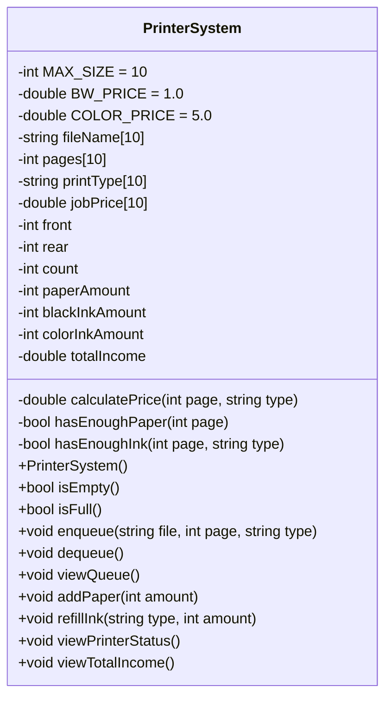
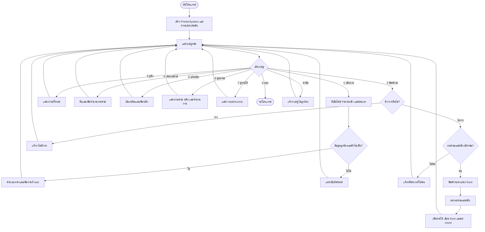

# แผนการพัฒนา Printer Job Scheduling System

## 1. ข้อมูลโครงการ

- **ชื่อระบบ:** Printer Job Scheduling System
- **ภาษาโปรแกรม:** C++
- **รูปแบบโปรแกรม:** Console Application
- **โครงสร้างข้อมูลหลัก:** Queue แบบ Circular Queue
- **หลักการจัดคิว:** FIFO (First In, First Out)
- **จำนวนคลาส:** 1 คลาส ชื่อ `PrinterSystem`
- **จำนวนสมาชิก:** 4 คน
- **ขนาดคิวเริ่มต้น:** รองรับงานพิมพ์สูงสุด 10 งาน

> เอกสารนี้กำหนดให้คำว่า “สี” หมายถึงประเภทการพิมพ์ ได้แก่ ขาวดำ (`BW`) และสี (`COLOR`) ไม่ใช่สีจริงของแผ่นกระดาษ

---

## 2. ที่มาและแนวคิดของระบบ

ระบบนี้ใช้จำลองการรับและจัดลำดับงานของเครื่องพิมพ์ เมื่อผู้ใช้ส่งไฟล์เข้ามา โปรแกรมจะนำงานไปต่อท้ายคิว และเลือกงานที่อยู่หน้าคิวไปพิมพ์ก่อนตามหลัก FIFO

นอกจากการจัดคิว ระบบต้องตรวจสอบจำนวนกระดาษและปริมาณหมึกก่อนพิมพ์ รวมถึงคำนวณค่าบริการจากจำนวนหน้าและประเภทการพิมพ์ หากกระดาษหรือหมึกไม่เพียงพอ ระบบจะไม่ลบงานออกจากคิว เพื่อให้สามารถเติมทรัพยากรแล้วกลับมาพิมพ์งานเดิมได้

---

## 3. วัตถุประสงค์

1. ศึกษาการทำงานของโครงสร้างข้อมูล Queue
2. ฝึกใช้ Array เพื่อเก็บข้อมูลหลายรายการ
3. ฝึกใช้ Class และการกำหนด `private` กับ `public`
4. จำลองการจัดลำดับงานพิมพ์แบบ FIFO
5. ตรวจสอบสถานะกระดาษและหมึกก่อนพิมพ์
6. คำนวณค่าบริการตามจำนวนหน้าและประเภทการพิมพ์
7. ฝึกแบ่งงาน พัฒนา รวมโค้ด และทดสอบร่วมกันเป็นทีม

---

## 4. ขอบเขตของระบบ

### 4.1 ความสามารถที่ต้องมี

ระบบต้องสามารถทำงานดังต่อไปนี้ได้

1. เพิ่มงานพิมพ์เข้าคิว
2. เก็บชื่อไฟล์ จำนวนหน้า ประเภทการพิมพ์ และราคา
3. ตรวจสอบว่าคิวเต็มหรือไม่
4. ตรวจสอบว่าคิวว่างหรือไม่
5. แสดงงานทั้งหมดที่กำลังรอพิมพ์
6. พิมพ์งานแรกในคิว
7. ตรวจสอบจำนวนกระดาษก่อนพิมพ์
8. ตรวจสอบหมึกตามประเภทงานก่อนพิมพ์
9. เติมกระดาษ
10. เติมหมึกดำหรือหมึกสี
11. คำนวณค่าบริการของแต่ละงาน
12. เก็บและแสดงรายได้รวมจากงานที่พิมพ์สำเร็จ
13. แสดงสถานะเครื่องพิมพ์
14. ตรวจสอบความถูกต้องของข้อมูลที่ผู้ใช้ป้อน

### 4.2 สิ่งที่ยังไม่รวมในระบบ

- การอ่านหรือพิมพ์ไฟล์จริงจากเครื่องคอมพิวเตอร์
- การเชื่อมต่อเครื่องพิมพ์จริง
- ระบบสมาชิกและการเข้าสู่ระบบ
- การชำระเงินผ่านธนาคารหรือบัตรเครดิต
- การบันทึกข้อมูลลงฐานข้อมูล
- การจัดลำดับงานแบบ Priority Queue
- การพิมพ์พร้อมกันหลายเครื่อง

---

## 5. ข้อกำหนดและสมมติฐาน

1. คิวเก็บงานได้สูงสุด 10 งาน
2. งานที่เข้าคิวก่อนต้องพิมพ์ก่อน
3. จำนวนหน้าต้องเป็นจำนวนเต็มมากกว่า 0
4. ประเภทการพิมพ์มีเพียง `BW` และ `COLOR`
5. งานขาวดำราคา 1 บาทต่อหน้า
6. งานสีราคา 5 บาทต่อหน้า
7. พิมพ์ 1 หน้า ใช้กระดาษ 1 แผ่น
8. พิมพ์ขาวดำ 1 หน้า ใช้หมึกดำ 1 หน่วย
9. พิมพ์สี 1 หน้า ใช้หมึกสี 1 หน่วย
10. ถ้ากระดาษหรือหมึกไม่เพียงพอ งานต้องคงอยู่ในคิว
11. รายได้รวมจะเพิ่มเมื่อพิมพ์งานสำเร็จเท่านั้น
12. จำนวนกระดาษและหมึกที่เติมต้องมากกว่า 0
13. ชื่อไฟล์ต้องไม่เป็นค่าว่าง

ค่าบริการสามารถปรับได้ภายหลังโดยเปลี่ยนค่า `BW_PRICE` และ `COLOR_PRICE`

---

## 6. ข้อมูลนำเข้าและผลลัพธ์

### 6.1 ข้อมูลนำเข้า

เมื่อเพิ่มงานพิมพ์ ระบบรับข้อมูลดังนี้

| ข้อมูล | ชนิดข้อมูล | ตัวอย่าง | เงื่อนไข |
|---|---|---|---|
| ชื่อไฟล์ | `string` | `report.pdf` | ต้องไม่ว่าง |
| จำนวนหน้า | `int` | `10` | ต้องมากกว่า 0 |
| ประเภทการพิมพ์ | `string` | `BW` หรือ `COLOR` | ต้องเป็นค่าที่กำหนด |

เมื่อเติมทรัพยากร ระบบรับข้อมูลดังนี้

| ข้อมูล | ชนิดข้อมูล | เงื่อนไข |
|---|---|---|
| จำนวนกระดาษที่เติม | `int` | ต้องมากกว่า 0 |
| ประเภทหมึก | `string` | `BLACK` หรือ `COLOR` |
| จำนวนหมึกที่เติม | `int` | ต้องมากกว่า 0 |

### 6.2 ผลลัพธ์

ระบบแสดงข้อมูลต่อไปนี้

- ผลการเพิ่มงานเข้าคิว
- ลำดับงานที่รอพิมพ์
- ชื่อไฟล์ จำนวนหน้า ประเภท และราคาของแต่ละงาน
- ผลการพิมพ์งาน
- สาเหตุที่พิมพ์ไม่ได้ เช่น คิวว่าง กระดาษไม่พอ หรือหมึกไม่พอ
- จำนวนกระดาษและหมึกคงเหลือ
- จำนวนงานในคิว
- รายได้รวม

---

## 7. โครงสร้างข้อมูล

เพื่อให้โปรแกรมมีเพียงหนึ่งคลาส จะใช้อาร์เรย์ 1 มิติหลายตัวแบบ Parallel Arrays โดยข้อมูลที่อยู่ตำแหน่งเดียวกันถือเป็นงานเดียวกัน

```cpp
string fileName[10];
int pages[10];
string printType[10];
double jobPrice[10];
```

ตัวอย่างข้อมูลตำแหน่งที่ 0

```text
fileName[0] = "report.pdf"
pages[0] = 10
printType[0] = "COLOR"
jobPrice[0] = 50.00
```

ตัวแปรควบคุม Circular Queue

| ตัวแปร | หน้าที่ |
|---|---|
| `front` | ชี้ตำแหน่งงานแรกที่ต้องพิมพ์ |
| `rear` | ชี้ตำแหน่งที่จะเพิ่มงานใหม่ |
| `count` | เก็บจำนวนงานที่อยู่ในคิว |

การเลื่อนตำแหน่งใช้สูตร

```cpp
rear = (rear + 1) % MAX_SIZE;
front = (front + 1) % MAX_SIZE;
```

สูตรนี้ทำให้ตำแหน่งวนกลับไปที่ 0 เมื่อถึงท้ายอาร์เรย์

---

## 8. Class Diagram



### ความหมายของสัญลักษณ์

- `-` หมายถึง `private` ใช้งานภายในคลาส
- `+` หมายถึง `public` สามารถเรียกจาก `main()` ได้

---

## 9. รายละเอียดตัวแปรภายในคลาส

| ตัวแปร | ชนิดข้อมูล | หน้าที่ |
|---|---|---|
| `MAX_SIZE` | `int` | ขนาดสูงสุดของคิว |
| `BW_PRICE` | `double` | ราคาขาวดำต่อหน้า |
| `COLOR_PRICE` | `double` | ราคาสีต่อหน้า |
| `fileName` | `string[]` | เก็บชื่อไฟล์ |
| `pages` | `int[]` | เก็บจำนวนหน้า |
| `printType` | `string[]` | เก็บประเภทการพิมพ์ |
| `jobPrice` | `double[]` | เก็บราคาของแต่ละงาน |
| `front` | `int` | ตำแหน่งหน้าคิว |
| `rear` | `int` | ตำแหน่งเพิ่มงานใหม่ |
| `count` | `int` | จำนวนงานในคิว |
| `paperAmount` | `int` | จำนวนกระดาษที่มี |
| `blackInkAmount` | `int` | ปริมาณหมึกดำ |
| `colorInkAmount` | `int` | ปริมาณหมึกสี |
| `totalIncome` | `double` | รายได้รวมจากงานสำเร็จ |

---

## 10. รายละเอียดฟังก์ชัน

### 10.1 `PrinterSystem()`

Constructor สำหรับกำหนดค่าเริ่มต้น เช่น

```text
front = 0
rear = 0
count = 0
paperAmount = 100
blackInkAmount = 100
colorInkAmount = 100
totalIncome = 0
```

### 10.2 `isEmpty()`

ตรวจว่าคิวว่างหรือไม่

```cpp
return count == 0;
```

### 10.3 `isFull()`

ตรวจว่าคิวเต็มหรือไม่

```cpp
return count == MAX_SIZE;
```

### 10.4 `calculatePrice(int page, string type)`

คำนวณราคาตามจำนวนหน้าและประเภทการพิมพ์

```text
ถ้า type เป็น BW
    ราคา = page × BW_PRICE
ถ้า type เป็น COLOR
    ราคา = page × COLOR_PRICE
```

### 10.5 `enqueue(string file, int page, string type)`

ขั้นตอนการเพิ่มงาน

1. ตรวจว่าคิวเต็มหรือไม่
2. ตรวจว่าชื่อไฟล์ไม่ว่าง
3. ตรวจว่าจำนวนหน้ามากกว่า 0
4. ตรวจว่าประเภทเป็น `BW` หรือ `COLOR`
5. คำนวณราคา
6. บันทึกข้อมูลลงอาร์เรย์ตำแหน่ง `rear`
7. เลื่อน `rear`
8. เพิ่ม `count`
9. แสดงผลว่ารับงานสำเร็จ

### 10.6 `hasEnoughPaper(int page)`

ตรวจว่ากระดาษเพียงพอสำหรับจำนวนหน้าของงานหรือไม่

```cpp
return paperAmount >= page;
```

### 10.7 `hasEnoughInk(int page, string type)`

ตรวจหมึกตามประเภทการพิมพ์

```text
ถ้าเป็น BW ตรวจ blackInkAmount
ถ้าเป็น COLOR ตรวจ colorInkAmount
```

### 10.8 `dequeue()`

ฟังก์ชันนี้ทำหน้าที่พิมพ์และนำงานแรกออกจากคิว

1. ตรวจว่าคิวว่างหรือไม่
2. อ่านจำนวนหน้าและประเภทของงานตำแหน่ง `front`
3. ตรวจว่ากระดาษเพียงพอหรือไม่
4. ตรวจว่าหมึกที่ต้องใช้เพียงพอหรือไม่
5. ถ้าทรัพยากรไม่พอ ให้แจ้งเตือนและเก็บงานไว้ในคิว
6. ถ้าทรัพยากรพอ ให้แสดงรายละเอียดการพิมพ์
7. ลดจำนวนกระดาษ
8. ลดหมึกตามประเภทการพิมพ์
9. เพิ่มราคางานเข้า `totalIncome`
10. เลื่อน `front`
11. ลด `count`

### 10.9 `viewQueue()`

แสดงงานทั้งหมดตั้งแต่ `front` จำนวน `count` งาน โดยคำนวณตำแหน่งด้วย

```cpp
int index = (front + i) % MAX_SIZE;
```

รายละเอียดที่ต้องแสดง

- ลำดับในคิว
- ชื่อไฟล์
- จำนวนหน้า
- ประเภทการพิมพ์
- ราคา

### 10.10 `addPaper(int amount)`

ตรวจว่าจำนวนที่เติมมากกว่า 0 แล้วเพิ่มเข้า `paperAmount`

### 10.11 `refillInk(string type, int amount)`

ตรวจชนิดและจำนวนหมึก แล้วเพิ่มเข้า `blackInkAmount` หรือ `colorInkAmount`

### 10.12 `viewPrinterStatus()`

แสดงสถานะต่อไปนี้

- จำนวนงานในคิว
- จำนวนกระดาษ
- หมึกดำ
- หมึกสี

### 10.13 `viewTotalIncome()`

แสดงรายได้รวม โดยกำหนดทศนิยม 2 ตำแหน่ง

---

## 11. เมนูหลัก

```text
========== Printer Job Scheduling System ==========
1. เพิ่มงานพิมพ์
2. พิมพ์งานแรกในคิว
3. แสดงงานทั้งหมดในคิว
4. เติมกระดาษ
5. เติมหมึก
6. แสดงสถานะเครื่องพิมพ์
7. แสดงรายได้รวม
0. ออกจากโปรแกรม
===================================================
เลือกเมนู: 
```

โปรแกรมต้องวนแสดงเมนูจนกว่าผู้ใช้จะเลือก `0`

---

## 12. Flowchart ของระบบ



---

## 13. Pseudocode ของโปรแกรมหลัก

```text
สร้าง object ชื่อ printer จาก class PrinterSystem

ทำซ้ำ
    แสดงเมนู
    รับค่า choice

    ถ้า choice = 1
        รับชื่อไฟล์ จำนวนหน้า และประเภท
        เรียก enqueue()

    ถ้า choice = 2
        เรียก dequeue()

    ถ้า choice = 3
        เรียก viewQueue()

    ถ้า choice = 4
        รับจำนวนกระดาษ
        เรียก addPaper()

    ถ้า choice = 5
        รับชนิดและจำนวนหมึก
        เรียก refillInk()

    ถ้า choice = 6
        เรียก viewPrinterStatus()

    ถ้า choice = 7
        เรียก viewTotalIncome()

    ถ้า choice = 0
        แสดงข้อความปิดโปรแกรม

    ถ้าเป็นค่าอื่น
        แสดงข้อความว่าเมนูไม่ถูกต้อง

จนกว่า choice = 0
```

---

## 14. การคำนวณราคา

### งานขาวดำ

```text
ราคา = จำนวนหน้า × 1 บาท
```

ตัวอย่าง งานขาวดำ 20 หน้า

```text
20 × 1 = 20 บาท
```

### งานสี

```text
ราคา = จำนวนหน้า × 5 บาท
```

ตัวอย่าง งานสี 20 หน้า

```text
20 × 5 = 100 บาท
```

ราคาของงานควรถูกคำนวณและบันทึกตอนเพิ่มเข้าคิว แต่รายได้รวมจะเพิ่มหลังจากพิมพ์สำเร็จเท่านั้น

---

## 15. การแบ่งงานสำหรับสมาชิก 4 คน

| สมาชิก | หน้าที่หลัก | รายละเอียดงาน | ผลงานที่ต้องส่ง |
|---|---|---|---|
| คนที่ 1 | วิเคราะห์และออกแบบ | สรุปความต้องการ, Class Diagram, Flowchart, โครงคลาส, Constructor, `isEmpty()`, `isFull()` | Diagram และโค้ดส่วนโครงสร้าง |
| คนที่ 2 | ระบบ Queue | `enqueue()`, `viewQueue()`, การเลื่อน `rear`, การแสดงงานตาม Circular Queue | โค้ดเพิ่มและแสดงงาน พร้อมผลทดสอบ |
| คนที่ 3 | ระบบพิมพ์และทรัพยากร | `dequeue()`, ตรวจกระดาษ, ตรวจหมึก, ลดทรัพยากร, `addPaper()`, `refillInk()` | โค้ดพิมพ์และจัดการทรัพยากร |
| คนที่ 4 | ราคา เมนู และการรวมระบบ | `calculatePrice()`, `viewPrinterStatus()`, `viewTotalIncome()`, `main()`, รวมโค้ด และทดสอบภาพรวม | โปรแกรมฉบับสมบูรณ์และรายงานผลทดสอบ |

### วิธีป้องกันงานชนกัน

1. ทุกคนใช้ชื่อคลาส ตัวแปร และฟังก์ชันตามเอกสารนี้
2. สร้างโครงคลาสกลางก่อนเริ่มเขียนฟังก์ชัน
3. แต่ละคนเขียนเฉพาะฟังก์ชันที่ตนรับผิดชอบ
4. ไม่เปลี่ยนชื่อฟังก์ชันเองโดยไม่แจ้งทีม
5. ส่งโค้ดเป็นรายฟังก์ชันให้คนที่ 4 รวม
6. หลังรวมโค้ด เจ้าของฟังก์ชันต้องช่วยตรวจสอบส่วนของตน

---

## 16. แผนการดำเนินงาน

### ระยะที่ 1: วิเคราะห์และออกแบบ

- ตกลงขอบเขตระบบ
- ตกลงราคาขาวดำและสี
- กำหนดขนาดคิว
- สร้าง Class Diagram
- สร้าง Flowchart
- กำหนดชื่อข้อมูลและฟังก์ชัน

### ระยะที่ 2: สร้างโครงโปรแกรม

- เขียน `#include`
- ประกาศคลาส `PrinterSystem`
- ประกาศตัวแปร `private`
- ประกาศฟังก์ชัน `public`
- สร้าง Constructor
- สร้างเมนูพื้นฐานใน `main()`

### ระยะที่ 3: พัฒนาฟังก์ชัน

- คนที่ 1 พัฒนาฟังก์ชันตรวจสอบคิว
- คนที่ 2 พัฒนาระบบเพิ่มและแสดงงาน
- คนที่ 3 พัฒนาระบบพิมพ์ กระดาษ และหมึก
- คนที่ 4 พัฒนาราคา สถานะ รายได้ และเมนู

### ระยะที่ 4: รวมระบบ

- รวมทุกฟังก์ชันเข้าไฟล์หลัก
- ตรวจชื่อพารามิเตอร์และชนิดข้อมูล
- ตรวจวงเล็บและเครื่องหมาย `;`
- Compile โปรแกรม
- แก้ Compilation Error

### ระยะที่ 5: ทดสอบ

- ทดสอบทีละฟังก์ชัน
- ทดสอบการทำงานร่วมกัน
- ทดสอบข้อมูลปกติ
- ทดสอบข้อมูลผิดเงื่อนไข
- ทดสอบขอบเขตคิวและ Circular Queue
- บันทึกผลที่คาดหวังและผลจริง

### ระยะที่ 6: จัดทำรายงานและนำเสนอ

- อธิบายปัญหาและวัตถุประสงค์
- แสดง Class Diagram และ Flowchart
- อธิบายหน้าที่ตัวแปรและฟังก์ชัน
- สาธิตการเพิ่มงาน พิมพ์งาน เติมทรัพยากร และคิดเงิน
- สรุปผลการทดสอบ
- สรุปหน้าที่ของสมาชิกแต่ละคน

---

## 17. แผนทดสอบระบบ

| รหัส | กรณีทดสอบ | ข้อมูลทดสอบ | ผลที่คาดหวัง |
|---|---|---|---|
| T01 | เพิ่มงานขาวดำ | `a.pdf`, 10, `BW` | เพิ่มงาน ราคา 10 บาท |
| T02 | เพิ่มงานสี | `b.pdf`, 10, `COLOR` | เพิ่มงาน ราคา 50 บาท |
| T03 | ชื่อไฟล์ว่าง | `""`, 10, `BW` | ปฏิเสธข้อมูล |
| T04 | จำนวนหน้าเป็นศูนย์ | `a.pdf`, 0, `BW` | ปฏิเสธข้อมูล |
| T05 | จำนวนหน้าติดลบ | `a.pdf`, -5, `BW` | ปฏิเสธข้อมูล |
| T06 | ประเภทไม่ถูกต้อง | `a.pdf`, 5, `RED` | ปฏิเสธข้อมูล |
| T07 | คิวเต็ม | เพิ่มครบ 10 งานแล้วเพิ่มอีก | แจ้งว่าคิวเต็ม |
| T08 | พิมพ์ตอนคิวว่าง | ไม่มีงาน | แจ้งว่าไม่มีงาน |
| T09 | กระดาษไม่พอ | งาน 20 หน้า มีกระดาษ 10 | ไม่พิมพ์และไม่ลบงาน |
| T10 | หมึกดำไม่พอ | งาน BW 20 หน้า หมึกดำ 10 | ไม่พิมพ์และไม่ลบงาน |
| T11 | หมึกสีไม่พอ | งาน COLOR 20 หน้า หมึกสี 10 | ไม่พิมพ์และไม่ลบงาน |
| T12 | พิมพ์สำเร็จ | ทรัพยากรเพียงพอ | ลดทรัพยากร ลบงาน และเพิ่มรายได้ |
| T13 | ตรวจ FIFO | เพิ่ม A, B, C แล้วพิมพ์ | พิมพ์ A ก่อน B และ C |
| T14 | ตรวจ Circular Queue | เพิ่มและนำออกหลายรอบ | ตำแหน่งวนได้และข้อมูลไม่เสีย |
| T15 | เติมกระดาษ | เติม 50 แผ่น | กระดาษเพิ่ม 50 |
| T16 | เติมหมึกผิดจำนวน | เติม -10 | ปฏิเสธข้อมูล |
| T17 | ตรวจรายได้รวม | พิมพ์ BW 10 หน้า และ COLOR 10 หน้า | รายได้รวม 60 บาท |
| T18 | เลือกเมนูผิด | เลือก 99 | แจ้งว่าเมนูไม่ถูกต้อง |

---

## 18. เกณฑ์การยอมรับงาน

โปรแกรมถือว่าสมบูรณ์เมื่อผ่านเงื่อนไขทั้งหมดต่อไปนี้

- Compile ผ่านโดยไม่มี Error
- ใช้คลาส `PrinterSystem` เพียงหนึ่งคลาส
- ใช้ Queue แบบ FIFO ได้ถูกต้อง
- เพิ่มงานได้ไม่เกิน 10 งาน
- แสดงงานเรียงตามลำดับคิวถูกต้อง
- ไม่พิมพ์เมื่องานในคิวไม่มี
- ไม่พิมพ์เมื่อกระดาษหรือหมึกไม่พอ
- งานที่พิมพ์ไม่สำเร็จยังอยู่ในคิว
- ลดกระดาษและหมึกอย่างถูกต้องหลังพิมพ์
- คำนวณราคาขาวดำและสีถูกต้อง
- รายได้เพิ่มเฉพาะงานที่พิมพ์สำเร็จ
- เติมกระดาษและหมึกได้
- โปรแกรมไม่หยุดทำงานเมื่อได้รับเมนูที่ไม่ถูกต้อง
- ผ่านกรณีทดสอบหลักทั้งหมด

---

## 19. ความเสี่ยงและวิธีป้องกัน

| ความเสี่ยง | ผลกระทบ | วิธีป้องกัน |
|---|---|---|
| สมาชิกใช้ชื่อฟังก์ชันไม่ตรงกัน | รวมโค้ดไม่ได้ | ใช้ชื่อจาก Class Diagram กลาง |
| ตำแหน่งอาร์เรย์ไม่สัมพันธ์กัน | ข้อมูลไฟล์และราคาไม่ตรงกัน | เขียนข้อมูลทุกอาร์เรย์ด้วย index เดียวกัน |
| ลืมตรวจคิวเต็มหรือว่าง | เข้าถึงข้อมูลผิดตำแหน่ง | เรียก `isFull()` และ `isEmpty()` ก่อนเสมอ |
| ลบงานทั้งที่พิมพ์ไม่สำเร็จ | งานสูญหาย | เลื่อน `front` หลังพิมพ์สำเร็จเท่านั้น |
| บวกรายได้ก่อนพิมพ์ | รายได้ผิด | เพิ่ม `totalIncome` หลังตรวจทรัพยากรผ่าน |
| Circular Queue ผิด | งานหายหรือแสดงผิด | ใช้ `% MAX_SIZE` ทุกครั้งที่เลื่อนตำแหน่ง |
| รับข้อมูลผิดชนิด | โปรแกรมอ่านข้อมูลล้มเหลว | ตรวจสถานะ input และล้าง input เมื่อจำเป็น |

---

## 20. รายการไฟล์ที่ควรส่ง

1. ไฟล์โปรแกรม C++ เช่น `printer_system.cpp`
2. ไฟล์แผนงานฉบับนี้
3. Class Diagram
4. Flowchart
5. ตารางผลการทดสอบ
6. รายงานสรุปหน้าที่สมาชิก
7. ภาพหน้าจอผลการทำงานของโปรแกรม

---

## 21. แนวทางการสาธิตโปรแกรม

ลำดับการสาธิตที่แนะนำ

1. แสดงสถานะเริ่มต้นของเครื่องพิมพ์
2. เพิ่มงานขาวดำ 1 งาน
3. เพิ่มงานสี 1 งาน
4. แสดงงานในคิวและราคาของแต่ละงาน
5. พิมพ์งานแรกเพื่อแสดง FIFO
6. แสดงกระดาษ หมึก และรายได้หลังพิมพ์
7. ทดลองเพิ่มงานที่ใช้กระดาษมากกว่าที่มี
8. แสดงว่าระบบไม่ลบงานเมื่อพิมพ์ไม่ได้
9. เติมกระดาษหรือหมึก
10. พิมพ์งานเดิมอีกครั้งจนสำเร็จ
11. แสดงรายได้รวม
12. ออกจากโปรแกรม

---

## 22. ส่วนขยายในอนาคต

หากต้องการพัฒนาต่อ สามารถเพิ่มความสามารถดังนี้

- กำหนดระดับความสำคัญของงาน
- ยกเลิกงานตามชื่อหรือรหัสงาน
- ค้นหางานในคิว
- รองรับการพิมพ์สองหน้า
- กำหนดขนาดกระดาษ เช่น A4 และ A3
- คิดราคาตามชนิดหรือสีจริงของกระดาษ
- บันทึกประวัติการพิมพ์
- รองรับผู้ใช้หลายคน
- เชื่อมต่อฐานข้อมูล
- สร้างหน้าจอแบบ GUI

หากต้องการคิดราคาตามสีจริงของแผ่นกระดาษ ให้เพิ่มอาร์เรย์ `paperColor[10]` และกำหนดราคาของกระดาษแต่ละสีแยกจาก `printType`
